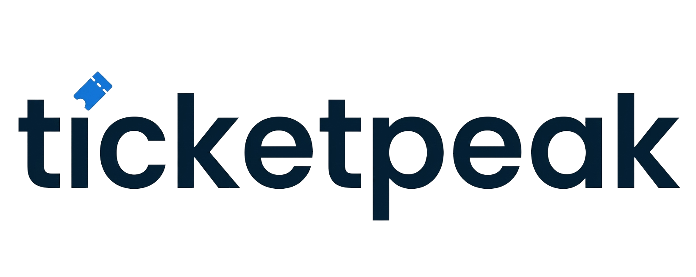

___

 
<strong>The modern ticketing platform — discover, buy, and sell event tickets with confidence </strong>

    

## What is Ticketpeak

Ticketpeak helps you discover, buy, and sell event tickets in a reliable and seamless way. The platform provides an integrated experience for event creation, seat management, and smart digital ticketing — all in one unified system. Built to make organizing and attending events simpler than ever.

## Features

**For Event Organizers**
- Create and publish events with rich media, categories, and venue details
- Seat map builder — general admission or assigned seating
- Multiple ticket tiers: VIP, Early Bird, Standard, with promo codes
- Real-time sales dashboard — revenue, attendance, conversion tracking
- Automatic post-event payouts via bank transfer
  
**For Ticket Buyers**
- Discover events by city, category, date, or keyword
- Fast, secure checkout 
- Smart TOTP-based QR tickets with rotating codes resistant to screenshots and ticket duplication
- Transfer tickets to friends in one tap
- Alerts when tickets drop for your favourite artists or venues  

**For the Platform**
- Anti-scalping: price caps and purchase limits on the secondary market
- Vietnamese and English support out of the box
 
## Table of Contents

- [Screenshots](#screenshots)
- [Tech Stack](#tech-stack)
- [Installation](#install)
- [Usage](#usage)
- [Contributing](#contributing)
- [Acknowledgments](#acknowledgments)
- [License](#license)

## Screenshots

  
## Tech Stack

**Frontend**: SvelteKit, shadcn-svelte, Tailwind CSS v4, TanStack Query   
**Backend**: Java 21, Spring Boot 3.5, Spring Security, Spring Data JPA, Flyway  
**Database**: PostgreSQL, Redis  
**Storage**: MinIO  
**Infrastructure**: Docker, GitHub Actions 
 
## Install 

## Usage

## Contributing

 
## Acknowledgments

Inspired by [Ticketmaster](https://www.ticketmaster.com/) — built with the goal of making live event ticketing more accessible, transparent, and developer-friendly for the Vietnamese market and beyond.
 
Thanks to all early contributors and testers who are helping shape Ticketpeak. 
  
## License 

[MIT](./LICENSE) © Hoàng Vũ
